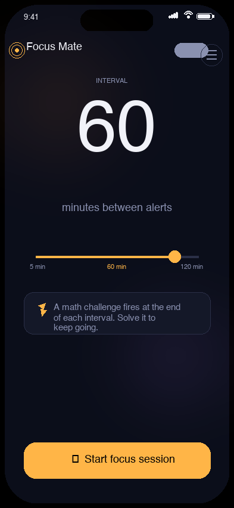
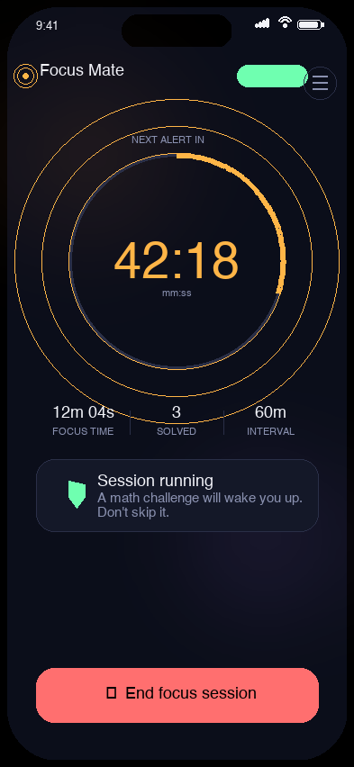
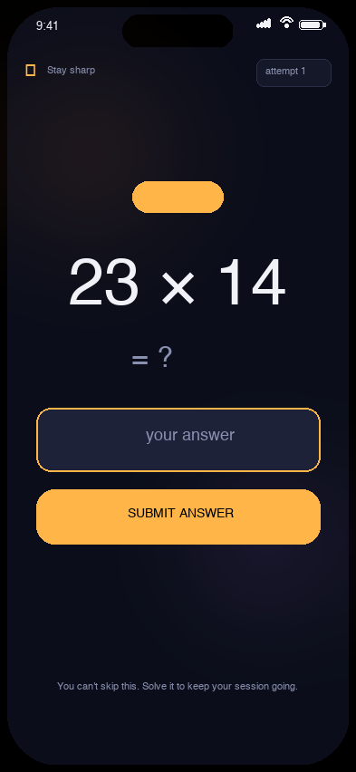
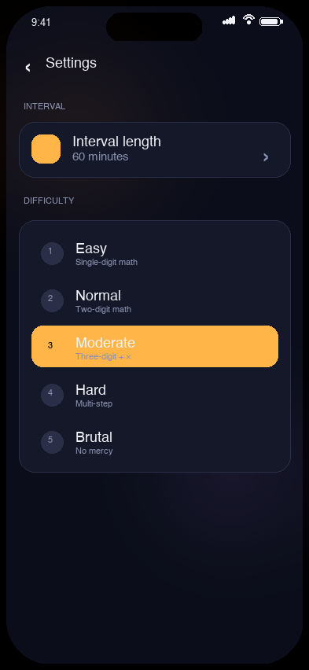

<div align="center">


# Focus Mate

**Stay sharp. Don't drift.**

An anti-drowsiness focus timer for work and study sessions. Set an interval;
when it expires, a math problem blocks the screen. You can't dismiss it without
solving the problem — so even if you start dozing off, the app forces a
periodic cognitive break.

[Install](#-install) ·
[Features](#-features) ·
[How it works](#-how-it-works) ·
[Architecture](#-architecture) ·
[Build from source](#-build-from-source) ·
[Contributing](#-contributing)

</div>

---

## ✨ Why Focus Mate?

| Common focus tools | Focus Mate |
|---|---|
| ❌ Play music and hope you don't drift | ✅ Forces you to engage every interval |
| ❌ Pomodoro timer with no engagement check | ✅ Math challenge to prove you're still with it |
| ❌ Silently buzzes while you doze | ✅ Escalates to a continuous alarm if you don't respond |
| ❌ All UI, no follow-through | ✅ Unskippable challenges, real cognitive breaks |

The science is simple: **drowsiness is reversible with a 10-second engagement break**.
A stretch, a sip of water, or solving a math problem. Focus Mate makes that
break *non-negotiable* and *cognitively active* — perfect for coding sessions,
deep work, or study marathons.

---

## 📱 Screenshots

<div align="center">

| Home (idle) | Home (focusing) | Math challenge |
|:---:|:---:|:---:|
|  |  |  |
| Set interval, start session | Live countdown with progress ring | Math problem to solve |

| Settings | Escalation alarm | Editor (custom interval) |
|:---:|:---:|:---:|
|  | _red pulsing UI + looping alarm_ | _scroll wheel + manual editor_ |

</div>

---

## 🚀 Features

### 🎯 Core
- **Customizable intervals** — 1 to 240 minutes via scroll wheel or manual editor
- **Math challenge** — 5 difficulty tiers (single-digit → 3-digit arithmetic) on a 60-second grace period
- **Anti-bypass lock** — `PopScope` + wakelock + ongoing notification = can't swipe away or screen-off
- **Foreground service** — math challenges survive backgrounding, app kill, even device reboot (Android 8+)

### 🛡️ Escalation
- **60-second grace period** (configurable: 15s/30s/60s/120s) to solve the challenge normally
- **Looping alarm** + vibration kicks in if you don't respond — continues until you touch the screen
- **Visual urgency** — red pulsing background overlay + "TOUCH SCREEN" pill + "STOP ALARM & SUBMIT" button
- **Bypasses Do Not Disturb** — uses `USAGE_ALARM` audio attribute on Android

### 📊 Tracking
- **Today stats** — focused time, problems solved, alarms triggered
- **Streak counter** — consecutive days using the app
- **Persistent settings** — everything in `SharedPreferences`, survives restart + reboot

### 🎨 Polish
- **Custom two-tone alarm** — procedurally generated C5-E5 ascending bell (no copyrighted assets)
- **Aurora animated background** — soft drifting gradients
- **Plus Jakarta Sans + JetBrains Mono** typography
- **Haptic feedback** on every interaction
- **Material 3** design language with custom dark theme

---

## 🧠 How it works

```
T = 0          [Start focus session]
                  ↓
T = 0..N       [Live countdown with progress ring]
                  ↓
T = N          [Alert fires, challenge starts]
                  ↓
T = N..N+60    [User has 60s to solve math problem]
                  ↓
T = N+60       [If unsolved: ESCALATION]
                  ├─ Looping alarm tone (C5-E5)
                  ├─ Vibration pattern (400ms on, 200ms off)
                  ├─ Red pulsing background
                  └─ "TOUCH SCREEN" indicator
                  ↓
[User touches screen OR types in answer]
                  ↓
                  ├─ Alarm silences
                  ├─ User gets another 60s to solve
                  ↓
[Correct answer submitted]
                  ↓
                  ├─ Stats updated (focus time, problems solved)
                  ├─ Next interval scheduled
                  └─ Return to T = 0..N
```

---

## 🏗️ Architecture

```
lib/
├── main.dart                       # App entry, MaterialApp, timezone setup
├── core/
│   ├── math_problem.dart           # MathProblem + MathProblemGenerator
│   ├── theme.dart                  # Brand colors, design tokens, Material 3 theme
│   └── alarm_sound_registry.dart   # Preset alarm sound definitions
├── services/
│   ├── notification_service.dart   # flutter_local_notifications wrapper + MethodChannel
│   ├── settings_repository.dart    # SharedPreferences-backed AppSettings + PomodoroSettings
│   └── stats_repository.dart       # Daily stat persistence + streak tracking
├── providers/
│   └── focus_provider.dart         # ChangeNotifier state machine (idle → running → challengeActive → escalated)
├── screens/
│   ├── home_screen.dart            # Idle + running views, today stats card
│   ├── challenge_screen.dart       # Full-screen math problem + escalation UI
│   └── settings_screen.dart        # Interval, difficulty, escalation, alarm toggles
└── widgets/
    ├── aurora_background.dart      # Animated mesh-gradient background
    ├── brand_mark.dart             # Custom-painted target/aperture logo
    ├── interval_wheel.dart         # Vertical scroll wheel with landmark values
    └── pulse_rings.dart            # Animated focus rings
```

### Native (Android) — `android/app/src/main/kotlin/id/focusmate/focus_mate/MainActivity.kt`
- MethodChannel handler for `id.focusmate.alarm`
- `MediaPlayer` with `isLooping = true` for the alarm sound
- `Vibrator` with repeating pattern
- `AudioAttributes.USAGE_ALARM` to bypass silent mode

### Native (iOS) — `ios/Runner/AppDelegate.swift`
- Same MethodChannel pattern
- `AVAudioPlayer` with `numberOfLoops = -1` (loop forever)

### State machine
- `FocusState` enum: `idle`, `running`, `challengeActive`, `escalated`
- State transitions are explicit and gated (e.g. can only escalate from `challengeActive`)
- All timers cancelled on state transition to prevent leaks

---

## 📦 Install

### Android (sideload)

1. Download the latest `FocusMate-arm64-vX.Y.Z-release-signed.apk` from
   [Releases](https://github.com/hellogunawan99/focus-mate/releases/latest)
2. Transfer to your Android device
3. **Enable "Install unknown apps"** for your file manager / browser
   (Settings → Apps → Special access → Install unknown apps)
4. Open the APK and tap **Install**

> **Note on signing:** v1.0.0–v1.0.5 used the Android debug key. v1.1.0+
> use a proper release keystore. If you have an older version installed,
> uninstall it first (signatures don't match).

### iOS

Build from source — see [Build from source](#-build-from-source) below.
(TestFlight / App Store distribution not yet set up.)

### Permissions

First launch will request:
- **Notifications** — required for the math challenge alert
- **Exact alarms** — required for interval-accurate scheduling
- **Battery optimization exemption** — prevents Android from killing the timer

---

## 🛠️ Build from source

### Prerequisites
- Flutter 3.44+ (Dart 3.12+)
- Android SDK 34+ (for Android builds)
- Xcode 15+ (for iOS builds)
- Java 17+ (for Android Gradle builds)

### Setup

```bash
git clone https://github.com/hellogunawan99/focus-mate.git
cd focus-mate
flutter pub get
```

### Android

```bash
flutter build apk --release --target-platform android-arm64
# Output: build/app/outputs/flutter-apk/app-arm64-v8a-release.apk
```

### iOS

```bash
cd ios && pod install && cd ..
flutter build ios --release
# Then open ios/Runner.xcworkspace in Xcode for device deployment
```

### Run in debug mode

```bash
flutter run                    # picks first connected device
flutter run -d <device-id>     # specific device
```

### Run tests

```bash
flutter test                   # all unit + widget tests
flutter test test/math_test.dart  # specific file
```

---

## 🧪 Testing

- **Unit tests** for `MathProblemGenerator` (problem difficulty, operator distribution)
- **Widget tests** for `IntervalWheel` (centering, scroll range, editor behavior, fling-bound clamps)
- All tests run on every commit via widget test suite

```bash
$ flutter test
+0: All tests passed!
```

---

## 🤝 Contributing

This is a personal-use project, but PRs and bug reports are welcome!

### Reporting bugs
1. Check [Issues](https://github.com/hellogunawan99/focus-mate/issues) first
2. Open a new issue with:
   - Device model + Android version
   - Focus Mate version (Settings → About)
   - Reproduction steps
   - Expected vs actual behavior

### Submitting PRs
1. Fork the repo
2. Create a feature branch (`git checkout -b feature/awesome-thing`)
3. Add tests for new behavior
4. Run `flutter analyze` + `flutter test` — must pass clean
5. Open a PR with a clear description

### Code style
- `flutter analyze` clean
- Prefer widget tests for any picker/scroll/offset math
- Document any new design tokens in `lib/core/theme.dart`

---

## 📄 License

MIT — see [LICENSE](LICENSE) for details.

---

## 🙏 Credits

- **App icon** — procedurally generated target/aperture mark (custom)
- **Alarm sound** — procedurally generated C5-E5 sine wave (custom)
- **Fonts** — [Plus Jakarta Sans](https://fonts.google.com/specimen/Plus+Jakarta+Sans),
  [JetBrains Mono](https://www.jetbrains.com/lp/mono/) (both open-source)
- **Built with** — [Flutter](https://flutter.dev), [Dart](https://dart.dev),
  [Material 3](https://m3.material.io), and a lot of `flutter_local_notifications` debugging

---

<div align="center">

**Focus Mate v1.1.3** · [hellogunawan99](https://github.com/hellogunawan99) · 2026

[⬆ Back to top](#focus-mate)

</div>
